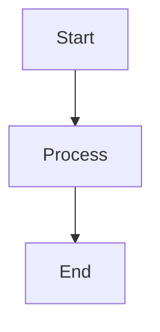

# InterRealm Docs

The official documentation website for InterRealm, built with [Docusaurus 3](https://docusaurus.io/).

## Features

- Modern static site generator powered by Docusaurus 3
- TypeScript support for type safety
- MDX support for interactive documentation
- Mermaid diagrams for visual representations
- Built-in blog functionality
- Dark mode support
- Mobile-responsive design
- Fast static site generation
- SEO friendly

## Prerequisites

Before you begin, ensure you have the following installed:

- **Node.js** >= 20.0
- **npm** or **yarn** or **pnpm** (package manager of your choice)

## Installation

Clone the repository and install dependencies:

```bash
# Clone the repository
git clone <repository-url>
cd interrealm-docs

# Install dependencies
npm install
# or
yarn install
# or
pnpm install
```

## Development

### Start Local Development Server

```bash
npm run start
# or
yarn start
```

This command starts a local development server at `http://localhost:3000` and opens up a browser window. Most changes are reflected live without having to restart the server.

### Other Development Commands

```bash
# Run TypeScript type checking
npm run typecheck

# Clear Docusaurus cache
npm run clear

# Generate translation files
npm run write-translations

# Generate heading IDs for markdown files
npm run write-heading-ids
```

## Build

Generate static content for production:

```bash
npm run build
# or
yarn build
```

This command generates static content into the `build` directory that can be served using any static hosting service.

### Test Production Build Locally

```bash
npm run serve
# or
yarn serve
```

This serves the production build locally for testing before deployment.

## Deployment

### GitHub Pages Deployment

If you're using GitHub Pages for hosting:

**Using SSH:**
```bash
USE_SSH=true npm run deploy
# or
USE_SSH=true yarn deploy
```

**Using HTTPS:**
```bash
GIT_USER=<Your GitHub username> npm run deploy
# or
GIT_USER=<Your GitHub username> yarn deploy
```

This command builds the website and pushes it to the `gh-pages` branch.

### Other Hosting Platforms

The `build` directory contains static files that can be deployed to:
- Vercel
- Netlify
- AWS S3
- Azure Static Web Apps
- Cloudflare Pages
- Any other static hosting service

## Project Structure

```
interrealm-docs/
├── blog/                  # Blog posts
├── docs/                  # Documentation pages
├── src/
│   ├── components/        # React components
│   ├── css/              # Custom CSS
│   └── pages/            # Custom pages
├── static/               # Static assets (images, etc.)
├── docusaurus.config.ts  # Docusaurus configuration
├── sidebars.ts           # Sidebar configuration
├── package.json          # Dependencies and scripts
└── tsconfig.json         # TypeScript configuration
```

## Configuration

- **docusaurus.config.ts**: Main configuration file for site metadata, themes, plugins, and more
- **sidebars.ts**: Configure the documentation sidebar structure
- **tsconfig.json**: TypeScript compiler options

## Writing Documentation

### Adding New Docs

1. Create a new `.md` or `.mdx` file in the `docs/` directory
2. Add front matter at the top:

```markdown
---
id: unique-id
title: Page Title
sidebar_label: Short Label
---

Your content here...
```

3. Update `sidebars.ts` if needed to include your new page

### Adding Blog Posts

Create a new file in the `blog/` directory with the naming convention:
- `YYYY-MM-DD-post-title.md`
- Or create a folder: `YYYY-MM-DD-post-title/index.md`

### Using Mermaid Diagrams

This project supports Mermaid diagrams. Use them in your markdown:

````markdown

````

## Contributing

Contributions are welcome! Please follow these steps:

1. Fork the repository
2. Create a new branch: `git checkout -b feature/your-feature-name`
3. Make your changes
4. Run type checking: `npm run typecheck`
5. Build the project: `npm run build`
6. Commit your changes: `git commit -m 'Add some feature'`
7. Push to the branch: `git push origin feature/your-feature-name`
8. Submit a pull request

### Code Style

- Follow TypeScript best practices
- Use meaningful commit messages
- Keep documentation clear and concise
- Test your changes locally before submitting

## Troubleshooting

### Clear Cache Issues

If you encounter build issues, try clearing the cache:

```bash
npm run clear
rm -rf node_modules package-lock.json
npm install
```

### Port Already in Use

If port 3000 is already in use, you can specify a different port:

```bash
npm run start -- --port 3001
```

## Resources

- [Docusaurus Documentation](https://docusaurus.io/)
- [MDX Documentation](https://mdxjs.com/)
- [Mermaid Documentation](https://mermaid.js.org/)
- [React Documentation](https://react.dev/)

## License

[Add your license here]

## Support

For questions or issues:
- Open an issue on GitHub
- Contact the InterRealm team

---

Built with care by the InterRealm team
